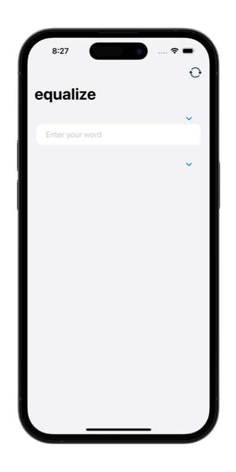
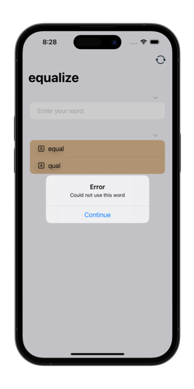
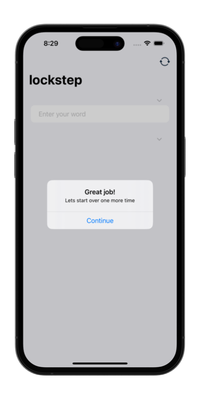

# &nbsp; Word Scramble

### Project 5  
##### Author: *[MatviiArtemenko](https://github.com/100DaysOfSwiftUI-MatviiArtemenko)*

##### 100DaysOfSwiftUI form *[@twostraws](https://twitter.com/twostraws "twostraws twitter page")*

##### Follow along: *[100DaysOfSwiftUI](https://www.hackingwithswift.com/100/swiftui "Hacking with Swift")*

---

> *This project was a last chance to review the fundamentals of SwiftUI before we move on to greater things with the next app. Still, we managed to cover some useful new things, not least `List`, `onAppear`, `Bundle`, `fatalError()`, `UITextChecker`, and more, and you have another app you can extend if you want to.*

---

## &nbsp; 📚 Covered topics

  List, Bundle, UITextChecker, onAppear, fatalError()

---
## &nbsp; 🎖 Challenge
* [x] Disallow answers that are shorter than three letters or are just our start word.

* [x] Add a toolbar button that calls `startGame()`, so users can restart with a new word whenever they want to.

* [x] Put a text view somewhere so you can track and show the player’s score for a given root word. How you calculate score is down to you, but something involving number of words and their letter count would be reasonable. 
 

---
## &nbsp; 📲 Screenshoot

  
  
  

---
##  &nbsp; 🔍 &nbsp; Resources 

* [Hacking With Swift - Scramble](https://www.hackingwithswift.com/books/ios-swiftui/word-scramble-wrap-up)
* [Apple documentation - UITextChecker](https://developer.apple.com/documentation/uikit/uitextchecker/)
